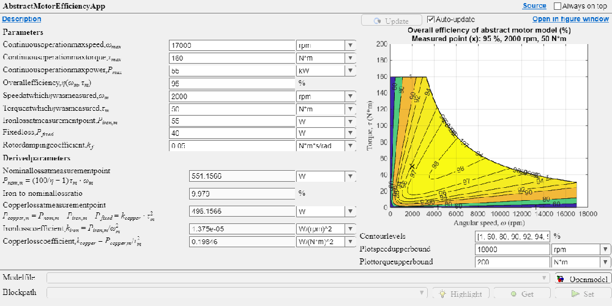
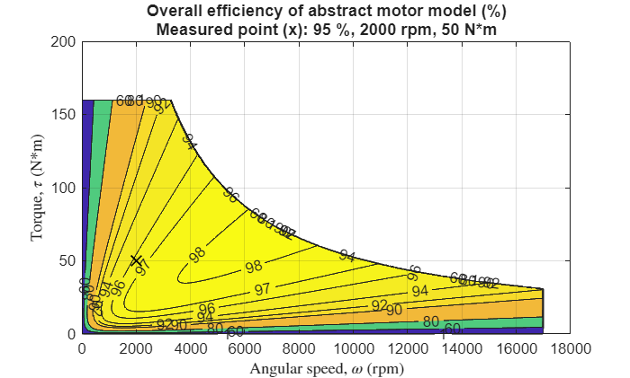
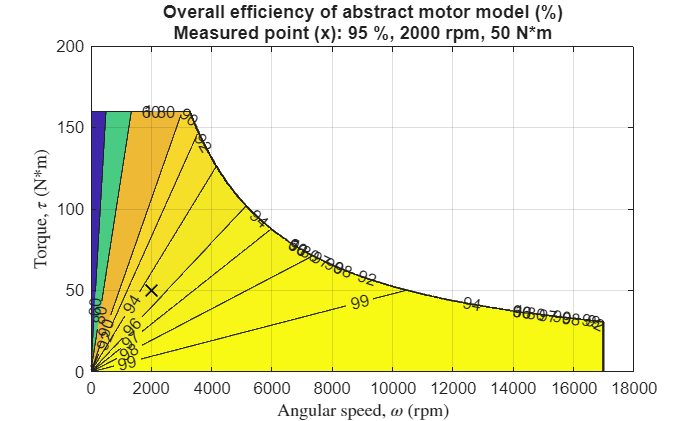
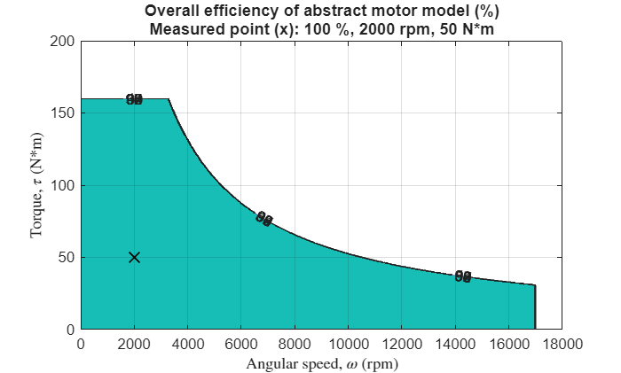

# Abstract Motor

The abstract motor model represents a system\-level motor drive unit (MDU) consisting of an electric motor and a controller. The model simulates the high\-level behavior of power conversion between electric and mechanical powers by considering power conversion efficiency. The following blocks use this model. See the respective documentation for more details about each block.

-  [Motor & Drive block](https://www.mathworks.com/help/sdl/ref/motordrive.html) (Simscape Driveline) 
-  [Motor & Drive (System\-Level) block](https://www.mathworks.com/help/sps/ref/motordrivesystemlevel.html) (Simscape Electrical) 

# The abstract motor efficiency app

Use the abstract motor efficiency app to understand how the parameters affect the motor efficiency.

# The abstract motor model

The core system equations of the abstract motor model are generally as follows.

The motor dynamics is computed as

 $$ J\;\frac{d\omega \;}{\textrm{dt}}=\tau {\;}_{\textrm{rot}} +\tau_{\textrm{cmd}} -k_f \;\omega \; $$ 

where $J$ is motor inertia. $t$ is time. $\omega \;$ is rotor angular speed. $\tau_{\textrm{rot}}$ is torque at motor rotor. $\tau_{\textrm{cmd}}$ is torque command input to MDU. $k_f$ is rotor frictional damping coefficient. The Motor & Drive block from Simscape Driveline does not include the rotor damping, thus an external damper block is required for non\-zero $k_f$ if necessary.

The mechanical power of the motor, $P_{\textrm{mech}}$, is computed as

 $$ P_{\textrm{mech}} =\tau {\;}_{\textrm{cmd}} \cdot \omega \; $$ 

The electrical power, $P_{\textrm{elec}}$, is computed as

 $$ P_{\textrm{elec}} =i\cdot V $$ 

where the sign of $P_{\textrm{elec}}$ indicates if the system is generating or consuming electric power. $i$ and $V$ are electric current and voltage drop, respectively, connected to DC power supply. $P_{\textrm{elec}}$ is converted to and from $P_{\textrm{mech}}$ and losses as

 $$ P_{\textrm{elec}} =P_{\textrm{mech}} +P_{\textrm{elecloss}} $$ 

where the electrical losses, $P_{\textrm{elecloss}}$, can be modelled as a scalar constant, a formula as a function of motor speed etc., or a tabulated map. Here, model it as a function of $\tau_{\textrm{rot}}$ and $\omega \;$ as follows.

 $$ P_{\textrm{elecloss}} \left(\tau_{\textrm{rot}} ,\;\omega \;\right)=P_{\textrm{copper}} \left(\tau_{\textrm{rot}} \right)+P_{\textrm{iron}} \left(\omega \;\right)+P_{\textrm{fixed}} $$ 

where $P_{\textrm{copper}}$ is copper loss. $P_{\textrm{iron}}$ is iron (core) loss. $P_{\textrm{fixed}}$ is fixed loss which is constant across the whole operating region. $P_{\textrm{copper}}$ and $P_{\textrm{iron}}$ are modelled as follows. (The Motor & Drive block from Simscape Driveline assumes that $P_{\textrm{iron}}$ and $P_{\textrm{fixed}}$ are zero.)

 $$ P_{\textrm{copper}} \left(\tau_{\textrm{rot}} \right)=k_{\textrm{copper}} \cdot {\left(\tau {\;}_{\textrm{rot}} \right)}^2 $$ 

 $$ P_{\textrm{iron}} \left(\omega \;\right)=k_{\textrm{iron}} \cdot \omega {\;}^2 $$ 

where $k_{\textrm{copper}}$ and $k_{\textrm{iron}}$ are copper loss coefficient and iron loss coefficient, respectively. They are determined later.

The nominal (rated) loss, $P_{\textrm{nom}}$, is computed as

 $$ P_{\textrm{nom}} =\left(\frac{1}{\eta \;}-1\right)P_{\textrm{mech}} $$ 

where $\eta \;$ is overall efficiency.

The motor temperature can be optionally computed as

 $$ M_{\textrm{therm}} \;\frac{d\;T_m }{\textrm{dt}}=P_{\textrm{elecloss}} +Q $$ 

where $M_{\textrm{therm}}$ is thermall mass of MDU. $T_m$ is MDU temperature. $Q$ is heat flow rate input to MDU.

## Determing the iron loss coeffcient and the copper loss coefficient

The iron loss coefficient $k_{\textrm{iron}}$ and the copper loss coefficient $k_{\textrm{copper}}$ are deteremined using the **single efficiency measurement model** as follows.

First, find the mechanical power at the efficiency measurement point ( $\omega_m$, $\tau_m$ ).

 $$ P_{\textrm{mech},m} =\tau_m \cdot \omega_m $$ 

Then the nominal (rated) loss at the measurement point is obtained.

 $$ P_{\textrm{nom},m} =\left(\frac{1}{\eta \;}-1\right)P_{\textrm{mech},m} $$ 

The iron (core) loss at the measurement point, $P_{\textrm{iron},m}$, is typically around 10% to 20% of $P_{\textrm{nom},m}$. Specify a value for $P_{\textrm{iron},m}$. (Use the efficiency app to visually inspect the efficiency contour map.) With $P_{\textrm{iron},m}$ having been specified, the iron loss coefficient, $k_{\textrm{iron}}$, is determined from the iron loss model.

 $$ k_{\textrm{iron}} =\frac{P_{\textrm{iron},m} }{{\left(\omega_m \right)}^2 } $$ 

The copper loss at the measurement point, $P_{\textrm{copper},m}$, is obrtained as follows.

 $$ P_{\textrm{copper},m} =P_{\textrm{nom},m} -P_{\textrm{iron},m} -P_{\textrm{fixed}} $$ 

 $k_{\textrm{copper}}$ can be determined from the copper loss model.

 $$ k_{\textrm{copper}} =\frac{P_{\textrm{copper},m} }{{\left(\tau_m \right)}^2 } $$ 
## Notes on the maximum motor speed

Maximum motor speed is not a parameter of the abstract motor model, and the Motor & Drive blocks do not have the maximum speed as a parameter, but it is typically defined by higher\-level system requirements.

For example, in the road vehicle applications, the vehicle top speed and a few other vehicle specs determine the maximum motor speed. Let $V$, $R$, $G$ be the vehicle top speed, tire rolling radius, and the reduction gear ratio, respectively. Then the maximum motor speed $\omega_{\max }$ is derived as

 $$ \omega_{\max } =\frac{V}{2\pi \;R\;G} $$ 

Example: When $V$ = 180 kph (112 mph), $R$ = 30 cm (12 in), $G$ = 1/10, then $\omega_{\max }$ = 15,915 rpm.

# Motor & Drive (System Level) block (Simscape Electrical)

Configure the Motor & Drive (System Level) block as follows.

-  Electrical Torque > Parameterized by: Maximum torque and power 
-  Electrical Losses > Parameterize losses by: Single efficiency measurement 

Then, use the abstract motor efficiency app or the following function with the block parameters to visualize the power conversion efficiency map.

# Motor & Drive block (Simscape Driveline)

Abstract motor model with the following settings corresponds to the Motor & Drive block.

-  Iron loss at measurement point, $P_{\textrm{iron},m}$ = 0 
-  Fixed loss, $P_{\textrm{fixed}}$ = 0 
-  Rotor damping coefficient, $k_f$ = 0 

# Ideal motor

By setting the overall efficiency $\eta \;$ to 100 % and losses to 0, the abstract motor model becomes an ideal motor where the power conversion has no loss in all operating area.

*Copyright 2020\-2026 The Mathworks, Inc.*

