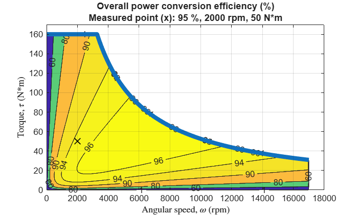
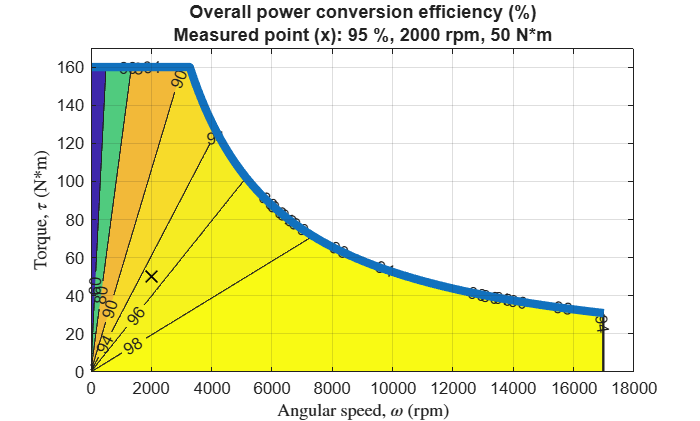
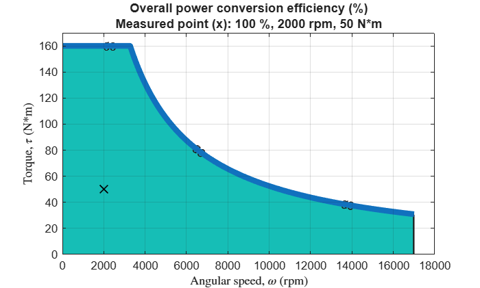

# Abstract Motor Efficiency App

The abstract motor efficiency app visualizes the power conversion efficiency contours of the abstract motor model. The model is used by [Motor & Drive (System\-Level)](https://www.mathworks.com/help/sps/ref/motordrivesystemlevel.html) block (Simscape Electrical) and [Motor & Drive](https://www.mathworks.com/help/sdl/ref/motordrive.html) block (Simscape Driveline).

The abstract motor model represents a system\-level motor drive unit (MDU) consisting of an electric motor and a controller. The model simulates the high\-level behavior of power conversion between electric and mechanical powers by considering conversion efficiency.

   

# Open the app

**`AbstractMotorEfficiencyApp`** opens the app.

<pre>
% Open the app with all defaults.
AbstractMotorEfficiencyApp
</pre>

**`AbstractMotorEfficiencyApp(AppParameterFileName=<file_name>, AppParameterStructName=<struct_name>)`** opens the app by first evaluating the specified **`<file_name>`** parameter file and then loading the specified **`<struct_name>`** struct from the base workspace to the app. These options correspond to the **Parameter file** and the **Variable name** in the app. The field names of the struct must match the app's parameter names as shown in the table.

| **App parameter**    | **Struct field name**    | **Value type**     |
| :-- | :-- | :-- |
| Continuous max angular speed mode     | MaxAngularSpeedMode    | "auto" or "specify"     |
| Continuous max angular speed, $\omega_{\max }$    | MaxAngularSpeed    | double or simscape.Value     |
| Continuous max torque, $\tau_{\max }$    | MaxTorque    | double or simscape.Value     |
| Continuous max power, $P_{\max }$    | MaxPower    | double or simscape.Value     |
| Overall efficiency, $\eta$    | OverallEfficiencyPercent    | double     |
| Speed at which $\eta$ was measured, $\omega_m$    | MeasuredAngularSpeed    | double or simscape.Value     |
| Torque at which $\eta$ was measured, $\tau_m$    | MeasuredTorque    | double or simscape.Value     |
| Iron losses at measurement speed, $P_{\mathrm{iron},m}$    | MeasuredIronLosses    | double or simscape.Value     |
| Fixed losses, $P_{\mathrm{fixed}}$    | FixedLosses    | double or simscape.Value     |
| Rotor damping coefficient, $k_f$    | RotorDampingCoefficient    | double or simscape.Value     |
| Plot auto range    | PlotAutoRange    | "on" or "off"     |
| Plot angular speed upper bound    | PlotAngularSpeedUpperBound    | double or simscape.Value     |
| Plot torque upper bound    | PlotTorqueUpperBound    | double or simscape.Value     |
| Plot contour levels    | PlotContourLevelsPercent    | array of double     |

For convenience, use AbstractMotorEfficiencyAppParameters to get predefined struct fields for a struct. For example, create a script as follows and save it as m`otor_parameters.m`.

<pre>
% Create an app parameters object. This enables the tab-completion to find and edit properties.
MotorParams = AbstractMotorEfficiency1.AbstractMotorEfficiencyAppParameters;

MotorParams.MaxAngularSpeedMode = "auto";
MotorParams.MaxTorque = simscape.Value(260, "N*m");
MotorParams.MaxPower = simscape.Value(55, "kW");

MotorParams.OverallEfficiencyPercent = 95;
MotorParams.MeasuredAngularSpeed = simscape.Value(2000, "rpm");
MotorParams.MeasuredTorque = simscape.Value(50, "N*m");
MotorParams.MeasuredIronLosses = simscape.Value(55, "W");
MotorParams.FixedLosses = simscape.Value(40, "W");
MotorParams.RotorDampingCoefficient = simscape.Value(0.05, "N*m/(rad/s)");

MotorParams.PlotAutoRange = "on";
MotorParams.PlotAngularSpeedUpperBound = simscape.Value(12000, "rpm");
MotorParams.PlotTorqueUpperBound = simscape.Value(300, "N*m");
MotorParams.PlotContourLevelsPercent = [1, 60, 80, 90, 96, 99];
</pre>

Then open the app with the parameter file and the struct.

<pre>
% Specified script file (*.m) must be on the MATLAB path.
AbstractMotorEfficiencyApp( ...
  AppParameterFileName = which("motor_parameters.m"), ...
  AppParameterStructName = "MotorParams" )
</pre>

**`AbstractMotorEfficiencyApp(AppParameterStructName=<struct_name>)`** opens the app by reading the specified **`<struct_name>`** struct from the base workspace. The struct must exist in the base workspace.

<pre>
% The MotorParams struct must exist in the base workspace.
AbstractMotorEfficiencyApp(AppParameterStructName="MotorParams")
</pre>

**`AbstractMotorEfficiencyApp(BlockPath=<block_path>)`** opens the app by opening the specified model and loading block parameters from the specified vehicle block.

<pre>
% The app opens the specified model and then loads block parameters from the specified block.
AbstractMotorEfficiencyApp(BlockPath="my_model/Motor & Drive")
</pre>

**`AbstractMotorEfficiencyApp(ModelName=<model_name>)`** opens the app by opening the specified model and loading block parameters from a block in the model. If there are more than two vehicle blocks, the first one is used.

<pre>
% Supported blocks must exist in the specified model.
AbstractMotorEfficiencyApp(ModelName="my_model")
</pre>

# The abstract motor efficiency model

The core system equations of the abstract motor model are generally as follows.

The motor dynamics is computed as

 $$ J\;\frac{d\omega \;}{\mathrm{dt}}=\tau {\;}_{\mathrm{rot}} +\tau_{\mathrm{cmd}} -k_f \;\omega \; $$

where $J$ is motor inertia. $t$ is time. $\omega \;$ is rotor angular speed. $\tau_{\mathrm{rot}}$ is torque at motor rotor. $\tau_{\mathrm{cmd}}$ is torque command input to MDU. $k_f$ is rotor frictional damping coefficient. The Motor \& Drive block from Simscape Driveline does not include the rotor damping, thus an external damper block is required for non\-zero $k_f$ if necessary.

The mechanical power of the motor, $P_{\mathrm{mech}}$, is computed as

 $$ P_{\mathrm{mech}} =\tau {\;}_{\mathrm{cmd}} \cdot \omega \; $$

The electrical power, $P_{\mathrm{elec}}$, is computed as

 $$ P_{\mathrm{elec}} =i\cdot V $$

where the sign of $P_{\mathrm{elec}}$ indicates if the system is generating or consuming electric power. $i$ and $V$ are electric current and voltage drop, respectively, connected to DC power supply. $P_{\mathrm{elec}}$ is converted to and from $P_{\mathrm{mech}}$ and losses as

 $$ P_{\mathrm{elec}} =P_{\mathrm{mech}} +P_{\mathrm{elecloss}} $$

where the electrical losses, $P_{\mathrm{elecloss}}$, can be modeled as a scalar constant, a formula as a function of motor speed etc., or a tabulated map. Here, model it as a function of $\tau_{\mathrm{rot}}$ and $\omega \;$ as follows.

 $$ P_{\mathrm{elecloss}} \left(\tau_{\mathrm{rot}} ,\;\omega \;\right)=P_{\mathrm{copper}} \left(\tau_{\mathrm{rot}} \right)+P_{\mathrm{iron}} \left(\omega \;\right)+P_{\mathrm{fixed}} $$

where $P_{\mathrm{copper}}$ is copper loss. $P_{\mathrm{iron}}$ is iron (core) loss. $P_{\mathrm{fixed}}$ is fixed loss which is constant across the whole operating region. $P_{\mathrm{copper}}$ and $P_{\mathrm{iron}}$ are modeled as follows. (The Motor \& Drive block from Simscape Driveline assumes that $P_{\mathrm{iron}}$ and $P_{\mathrm{fixed}}$ are zero.)

 $$ P_{\mathrm{copper}} \left(\tau_{\mathrm{rot}} \right)=k_{\mathrm{copper}} \cdot {\left(\tau {\;}_{\mathrm{rot}} \right)}^2 $$

 $$ P_{\mathrm{iron}} \left(\omega \;\right)=k_{\mathrm{iron}} \cdot \omega {\;}^2 $$

where $k_{\mathrm{copper}}$ and $k_{\mathrm{iron}}$ are copper loss coefficient and iron loss coefficient, respectively. They are determined later.

The nominal (rated) loss, $P_{\mathrm{nom}}$, is computed as

 $$ P_{\mathrm{nom}} =\left(\frac{1}{\eta \;}-1\right)P_{\mathrm{mech}} $$

where $\eta \;$ is overall efficiency.

The motor temperature can be optionally computed as

 $$ M_{\mathrm{therm}} \;\frac{d\;T_m }{\mathrm{dt}}=P_{\mathrm{elecloss}} +Q $$

where $M_{\mathrm{therm}}$ is thermal mass of MDU. $T_m$ is MDU temperature. $Q$ is heat flow rate input to MDU.

## Determine the iron loss coefficient and the copper loss coefficient

The iron loss coefficient $k_{\mathrm{iron}}$ and the copper loss coefficient $k_{\mathrm{copper}}$ are determined using the **single efficiency measurement model** as follows.

First, find the mechanical power at the efficiency measurement point ( $\omega_m$, $\tau_m$ ).

 $$ P_{\mathrm{mech},m} =\tau_m \cdot \omega_m $$

Then the nominal (rated) losses at the measurement point are obtained.

 $$ P_{\mathrm{nom},m} =\left(\frac{1}{\eta \;}-1\right)P_{\mathrm{mech},m} $$

The iron (core) losses at the measurement point, $P_{\mathrm{iron},m}$, are typically around 10\% to 20\% of $P_{\mathrm{nom},m}$. Specify a value for $P_{\mathrm{iron},m}$. (Use the efficiency app to visually inspect in the power conversion efficiency plot.) With $P_{\mathrm{iron},m}$ having been specified, the iron loss coefficient, $k_{\mathrm{iron}}$, is determined from the iron loss model.

 $$ k_{\mathrm{iron}} =\frac{P_{\mathrm{iron},m} }{{\left(\omega_m \right)}^2 } $$

The copper losses at the measurement point, $P_{\mathrm{copper},m}$, are obtained as follows.

 $$ P_{\mathrm{copper},m} =P_{\mathrm{nom},m} -P_{\mathrm{iron},m} -P_{\mathrm{fixed}} $$

 $k_{\mathrm{copper}}$ can be determined from the copper loss model.

 $$ k_{\mathrm{copper}} =\frac{P_{\mathrm{copper},m} }{{\left(\tau_m \right)}^2 } $$

The single efficiency measurement model does not consider the rotor damping. Thus, the efficiency at the measurement point in a power conversion efficiency plot with $k_f$ > 0 is smaller than the specified overall efficiency $\eta$. To see the efficiency plot without rotor damping, set $k_f$ to 0.

## Notes on the maximum motor speed

Maximum motor speed is not a parameter of the abstract motor model, and the Motor & Drive blocks do not have the maximum speed as a parameter, but it is typically defined by higher\-level system requirements.

For example, in the road vehicle applications, the vehicle top speed and a few other vehicle specs determine the maximum motor speed. Let $V$, $R$, $G$ be vehicle top speed, tire rolling radius, and reduction gear ratio, respectively. Then the maximum motor speed $\omega_{\max }$ is determined by

 $\omega_{\max } =\frac{V}{2\pi \;R\;G}$.

Example: When $V$ = 180 km/h (112 mph), $R$ = 30 cm (12 in), $G$ = 1/10, then $\omega_{\max }$ = 15,915 rpm.

# Motor & Drive (System Level) block (Simscape Electrical)

Configure the Motor & Drive (System Level) block as follows.

- Electrical Torque > Parameterized by: Maximum torque and power
- Electrical Losses > Parameterize losses by: Single efficiency measurement

Then, use the abstract motor efficiency app or the following function to visualize the power conversion efficiency map.

# Motor & Drive block (Simscape Driveline)

Abstract motor model with the following settings corresponds to the Motor & Drive block.

- Iron losses at measurement point, $P_{\mathrm{iron},m}$ = 0
- Fixed losses, $P_{\mathrm{fixed}}$ = 0
- Rotor damping coefficient, $k_f$ = 0

While iron losses (angular speed\-dependent losses) are ignored, copper losses (torque\-dependent losses) are still considered.

# Ideal motor

By setting the overall efficiency $\eta \;$ to 100 % and losses to 0, the abstract motor model becomes an ideal motor where the power conversion has no losses in all operating region.

*Copyright 2020\-2026 The Mathworks, Inc.*
