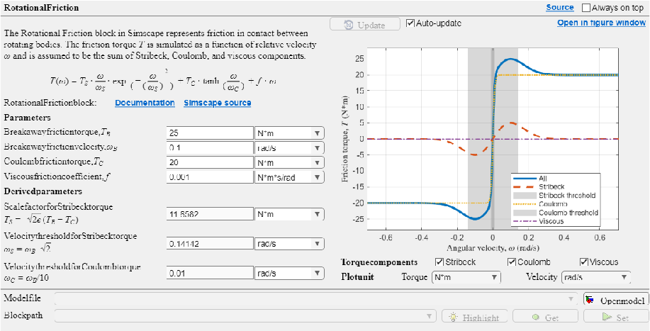

# Rotational Friction App

The <samp>RotationalFrictionApp</samp> is an app to help you understand the rotational friction torque model used in the Rotational Friction block in Simscape.

By launching without options, the app works as a stand alone app. To link a model containing a Rotational Friction block after the app launched, use the "Open model" button. To launch the app with linking a Rotational Friction block in a model, use the options described below.

# Options

<samp>BlockPath = path/to/block</samp>

-  Use <samp>BlockPath</samp> to load the block parameters of the specified Rotational Friction block in a model. 

<samp>ModelName = "model_name"</samp>

-  Use ModelName to load the block parameters of a Rotational Friction block in a model. The app searches Rotational Friction blocks in the specified model. 

<samp>BlockPath</samp> takes the precedence over <samp>ModelName</samp>.

*Copyright 2025\-2026 The MathWorks, Inc.*

