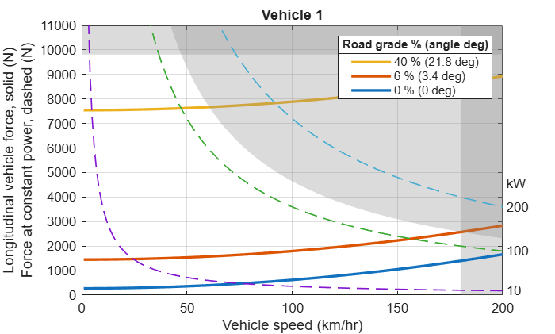
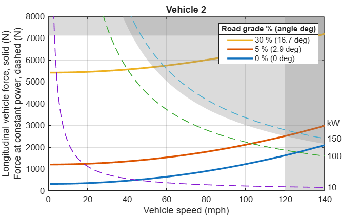

# <span style="color:rgb(213,80,0)">Vehicle 1D Force App</span>

The vehicle 1d force app visualizes the longitudinal vehicle force model. The model is used by the [Longitudinal Vehicle](https://www.mathworks.com/help/sdl/ref/longitudinalvehicle.html) block (Simscape Driveline).

<p style="text-align:left">
   
</p>

# Open the app

**`Vehicle1DForceApp`** opens the app.

<pre>
% Open the app with all defaults.
Vehicle1DForceApp
</pre>

**`Vehicle1DForceApp(AppParameterFileName=<file_name>, AppParameterStructName=<struct_name>)`** opens the app by first evaluating the specified **`<file_name>`** parameter file and then loading the specified **`<struct_name>`** struct from the base workspace to the app. These options correspond to the **Parameter file** and the **Variable name** in the app. The field names of the struct must match the app's parameter names as shown in the table.

| **App parameter** <br>  | **Struct field name** <br>  | **Value type** <br>   |
| :-- | :-- | :-- |
| Vehicle mass, $M_v$ <br>  | VehicleMass <br>  | double or simscape.Value <br>   |
| Tire rolling coefficient, $C_{\mathrm{roll}}$ <br>  | TireRollingRadius <br>  | double <br>   |
| Air drag coefficient, $C_d$ <br>  | AirDragCoefficient <br>  | double <br>   |
| Frontal area, $A_f$ <br>  | FrontalArea <br>  | double or simscape.Value <br>   |
| Gravitational acceleration, $g$ <br>  | GravitationalAcceleration <br>  | double or simscape.Value <br>   |
| Dry air density, $\rho \;$ <br>  | DryAirDensity <br>  | double or simscape.Value <br>   |
| Road\-load coefficient, $B_{rl}$ <br>  | RoadLoadB <br>  | double <br>   |
| Top speed, $V_{\max }$ <br>  | TopSpeed <br>  | double or simscape.Value <br>   |
| Max climb grade, $B_{\max }$ <br>  | MaxClimbGradePercent <br>  | double <br>   |
| Max acceleration, $g_{\max }$ <br>  | MaxAcceleration <br>  | double <br>   |
| Plot speed upper bound <br>  | PlotSpeedUpperBound <br>  | double or simscape.Value <br>   |
| Plot force upper bound <br>  | PlotForceUpperBound <br>  | double or simscape.Value <br>   |
| Plot road grades <br>  | PlotGrades <br>  | array of double <br>   |
| Plot constant power curves <br>  | PlotPowers <br>  | array of double or simscape.Value <br>   |

For convenience, use `Vehicle1DForceAppParameters` to get predefined struct fields for a struct. For example, create a script as follows and save it as v`ehicle_parameters.m`.

<pre>
% Use Vehicle1DForceAppParameters to get predefined fields for the app parameters.
% This provides tab-completion for edit too.
VehicleParams = Vehicle1DForce1.Vehicle1DForceAppParameters;

VehicleParams.VehicleMass = simscape.Value(5000, "lbm");
VehicleParams.TireRollingCoefficient = 0.014;
VehicleParams.AirDragCoefficient = 0.33;
VehicleParams.FrontalArea = simscape.Value(2.5, "m^2");

VehicleParams.GravitationalAcceleration = simscape.Value(9.81, "m/s^2");
VehicleParams.DryAirDensity = simscape.Value(1.184, "kg/m^3");

VehicleParams.RoadLoadB = simscape.Value(0, "N/(m/s)");

VehicleParams.TopSpeed = simscape.Value(160, "km/hr");
VehicleParams.MaxClimbGradePercent = 5;
VehicleParams.MaxAcceleration = 0.38;

VehicleParams.PlotSpeedUpperBound = simscape.Value(180, "km/hr");
VehicleParams.PlotForceUpperBound = simscape.Value(10000, "N");
VehicleParams.PlotGrades = [0, 5, 10, 20, 35];
VehicleParams.PlotPowers = simscape.Value([10, 50, 100], "kW");
</pre>

Then open the app with the parameter file and the struct.

<pre>
% Specified script file (*.m) must be on the MATLAB path.
Vehicle1DForceApp( ...
  AppParameterFileName = which("vehicle_parameters.m"), ...
  AppParameterStructName = "VehicleParams" )
</pre>

**`Vehicle1DForceApp(AppParameterStructName=<struct_name>)`** opens the app by reading the specified **`<struct_name>`** struct from the base workspace. The struct must exist in the base workspace.

<pre>
% The VehicleParams struct must exist in the base workspace.
Vehicle1DForceApp(AppParameterStructName="VehicleParams")
</pre>

**`Vehicle1DForceApp(BlockPath=<block_path>)`** opens the app by opening the specified model and loading block parameters from the specified vehicle block.

<pre>
% The app opens the specified model and then loads block parameters from the specified block.
Vehicle1DForceApp(BlockPath="my_model/Longitudinal Vehicle")
</pre>

**`Vehicle1DForceApp(ModelName=<model_name>)`** opens the app by opening the specified model and loading block parameters from a block in the model. If there are more than two vehicle blocks, the first one is used.

<pre>
% Supported blocks must exist in the specified model.
Vehicle1DForceApp(ModelName="my_model")
</pre>

# Programmatically visualize longitudinal vehicle force

Use `plotVehicle1DForcea` to create a plot programmatically. The app internally calls this function. The function supports two different ways to specify parameters using the `DataSource` option; `DataSource="direct"` or `DataSource="dataset"`.

The following is an example of using `DataSource="direct"`.

<center></center>

The following is an example of using `DataSource="dataset"`. In this case, first create a `Vehicle1DForceDataSet` object, specify parameters, update the object, and then pass it to the plot function.

<center></center>

By using the data set, you can access internal information including derived parameters.

```matlabTextOutput
ans = 
  320.3814 (N)


```

```matlabTextOutput
ans = 
    0.4537 (N*s^2/m^2)


```

```matlabTextOutput
ans = 
   7.1196e+03 (N)


```

```matlabTextOutput
ans = 
  134.8937 (kW)


```

Below is an example of obtaining the power in brake horsepower (bhp) or in metric horsepower (ps).

```matlabTextOutput
ans = 
  180.8954 (bhp)


```

```matlabTextOutput
ans = 
  183.4041 (ps)


```

*Copyright 2026 The MathWorks, Inc.*