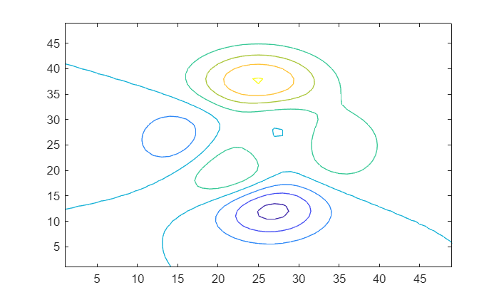

# <span style="color:rgb(213,80,0)">Sample script</span>

For testing

```matlab
x = 1;
disp(x)
```

```matlabTextOutput
     1
```

```matlab
contour(peaks)
```

<center></center>


*Copyright 2025 The MathWorks, Inc.*

