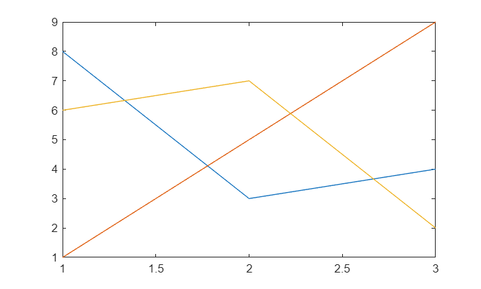

# <span style="color:rgb(213,80,0)">Sample script</span>

For testing

```matlab
y = 2;
disp(y)
```

```matlabTextOutput
     2
```

```matlab
plot(magic(3))
```

<center></center>


*Copyright 2025 The MathWorks, Inc.*

