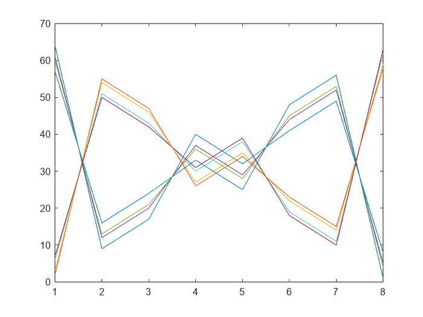

# <span style="color:rgb(213,80,0)">Sample script</span>

For testing

```matlab
k = -0.2;
disp(k^2)
```

```matlabTextOutput
    0.0400
```

```matlab
plot(magic(8))
```

<center></center>


*Copyright 2026 The MathWorks, Inc.*

