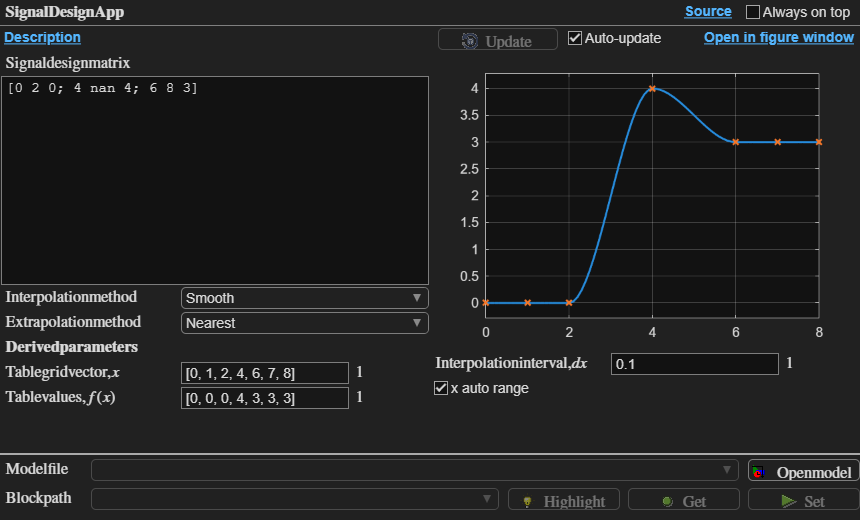
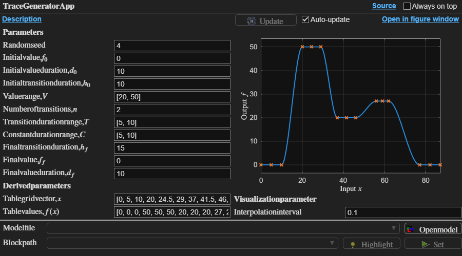
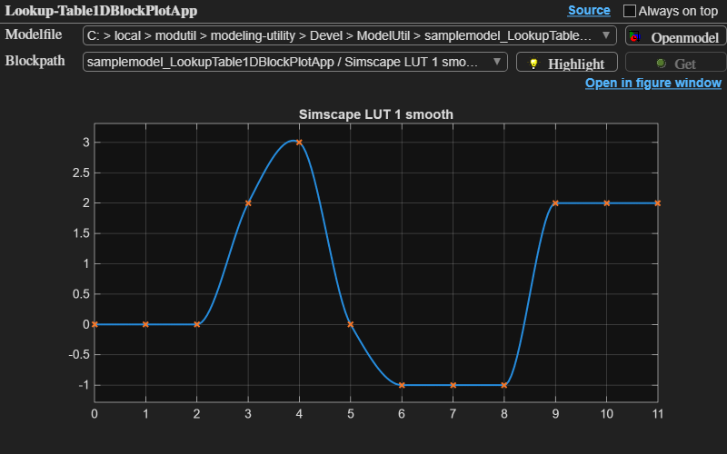
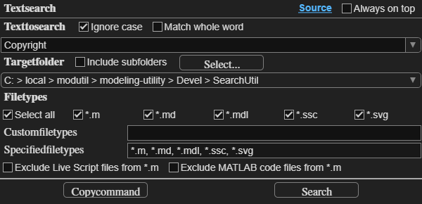
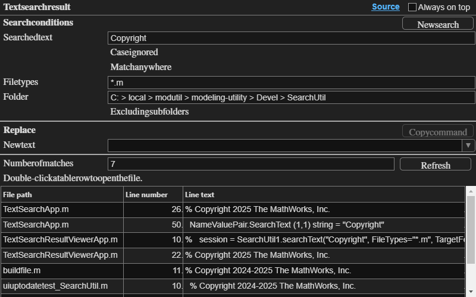
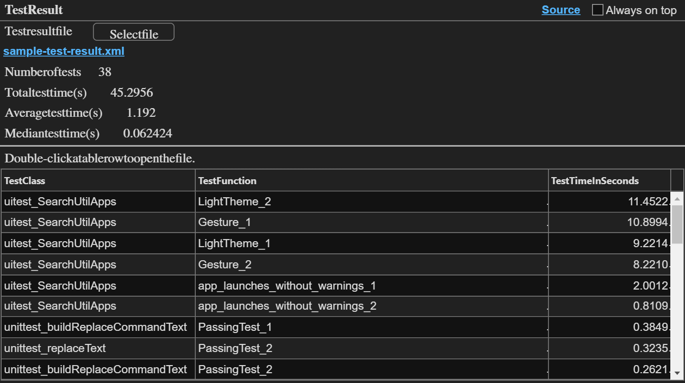
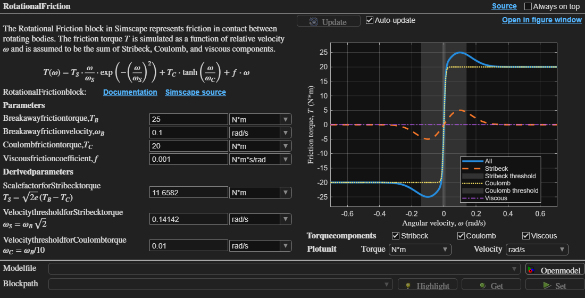

# Modeling Utility for Simscape™

This is a collection of MATLAB® APIs and apps to streamline
modeling workflows with Simscape.

The latest release:

- [modutil-simscape-v0.0.1-R2025b.zip](https://github.com/isaacito12/modutil-simscape/releases/download/v0.0.1/modutil-simscape-v0.0.1-R2025b.zip)

## Set up

To use this utility, put the `ModelingUtilityForSimscape` folder
in a desired location in your computer and add the folder to the MATLAB path.

## **AppUtil** - Build apps programmatically

- Use the `AppUtil` API to easily build simple apps programmatically.
- The API uses the `uifigure` and `uigridlayout` functions.
- The API is fully compatible with all UI components that work
  with `uifigure` and `uigridlayout`.
- All of the apps included in this utility are built with the `AppUtil` API.

## **SignalUtil** - Design signals for simulation

### `SignalDesignApp`

Use the `SignalDesignApp` to create input signals for simulation.

The app can transfer the signal parameters to Lookup Table blocks
in Simscape or in Simulink.
The app can also get signal parameters from existing Lookup Table blocks.

### `TraceGeneratorApp`

Use the `TraceGeneratorApp` to generate signal traces from high-level signal properties
and a random number generator.

## **ModelUtil** - Lookup table visualization

Use the `LookupTable1DBlockPlotApp` to find and visualize
Simscape PS Lookup Table (1D) blocks and Simulink 1-D Lookup Table blocks
in models.

## **SearchUtil** - Text search and replace

Use the `TextSearchApp` and the `TextSearchResultViewerApp` to search
and replace text in files and models.

Use the `SearchUtil` API for complex search and replace operations.

## **TestUtil** - Helper utility for testing

Use the `TestResultApp` to view test result generated by the Build Tool
and jump to a unit test code from the app.

## Apps for physical systems

### Rotational friction app

Use the `RotationalFrictionApp` to understand the friction model
and its parameters used in the Rotational Friction block in Simscape.

## Development of the utility

The development repository is hosted in GitHub:

https://github.com/isaacito12/modutil-simscape

## License

See `license.txt` for details.

_Copyright 2025-2026 The MathWorks, Inc._
