# Modeling Utility for Simscape™

This is a collection of MATLAB® apps and APIs to streamline
modeling workflows with Simscape.

The latest release of this utility is available at the following site:

- https://github.com/isaacito12/modutil-simscape/releases

## Set up

To use this utility, put the `ModelingUtilityForSimscape` folder
in a desired location in your computer and add the folder to the MATLAB path.

## Apps for physical systems

### Vehicle 1d force app

### Abstract motor efficiency app

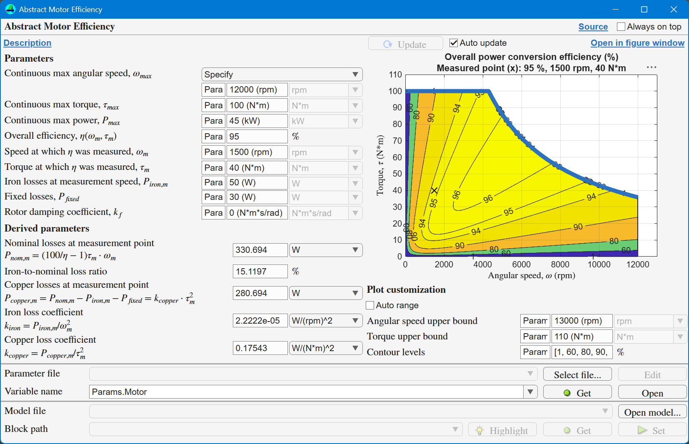

### Rotational friction torque app

Use the `RotationalFrictionTorqueApp` to understand the friction model
and its parameters used in the Rotational Friction block in Simscape.

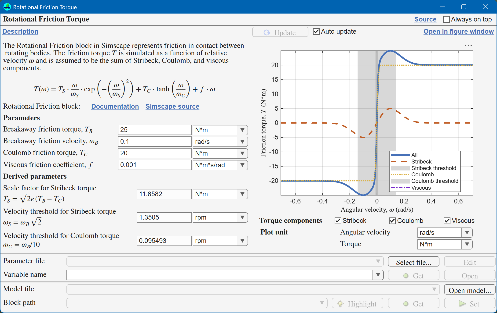

## **SignalUtil** - Design signals for simulation

### `SignalDesignApp`

Use the `SignalDesignApp` to create input signals for simulation.

The app can transfer the signal parameters to Lookup Table blocks
in Simscape or in Simulink.
The app can also get signal parameters from existing Lookup Table blocks.

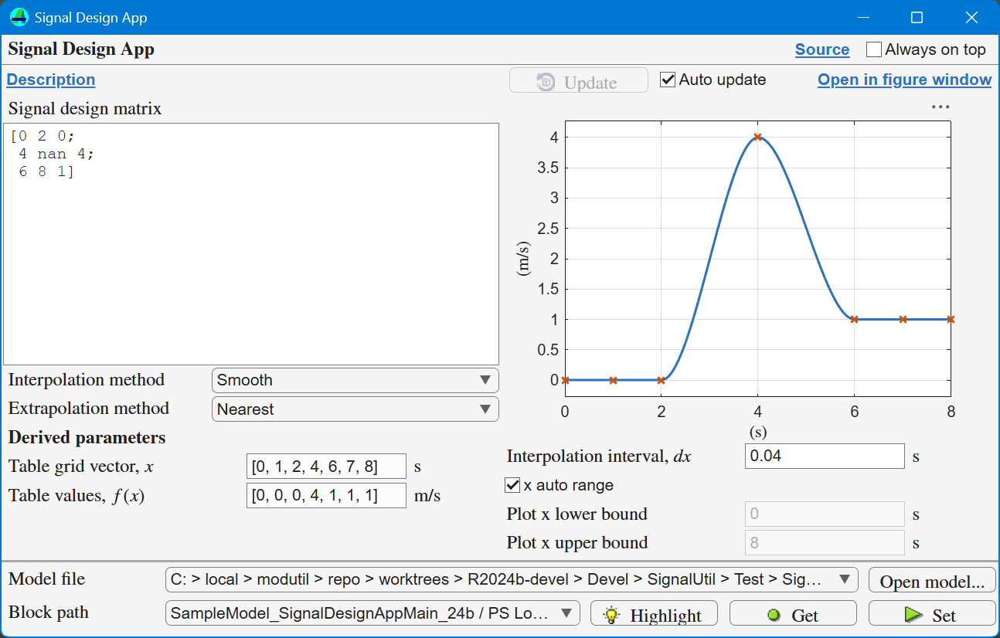<!-- w=860px -->

### `TraceGeneratorApp`

Use the `TraceGeneratorApp` to generate signal traces from high-level signal properties
and a random number generator.

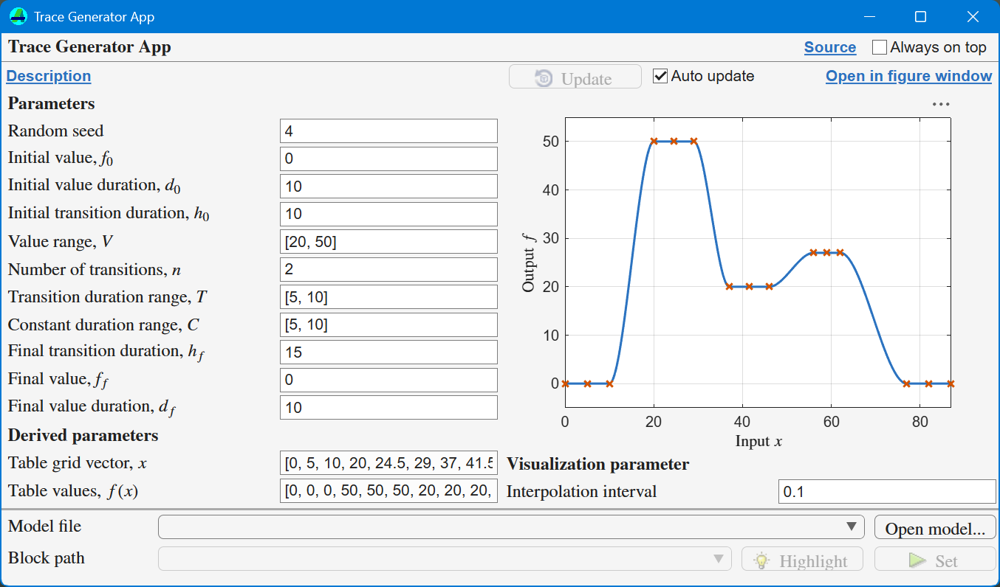<!-- w=900px -->
 
## **ModelUtil** - Lookup table visualization

Use the `LookupTable1DBlockPlotApp` to find and visualize
Simscape PS Lookup Table (1D) blocks and Simulink 1-D Lookup Table blocks
in models.

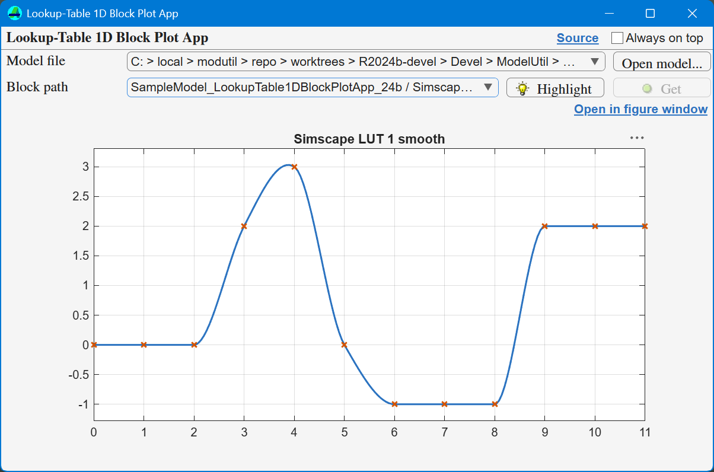<!-- w=800px -->

## **SearchUtil** - Text search and replace

Use the `SearchUtil` API for complex search and replace operations.

Use the `TextSearchApp` and the `TextSearchResultViewerApp` to search
and replace text in files and models.

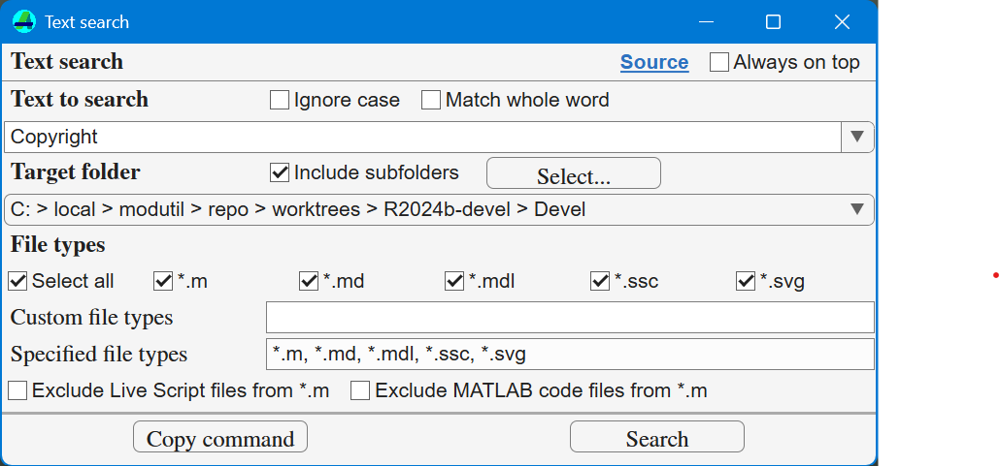<!-- w=600px -->

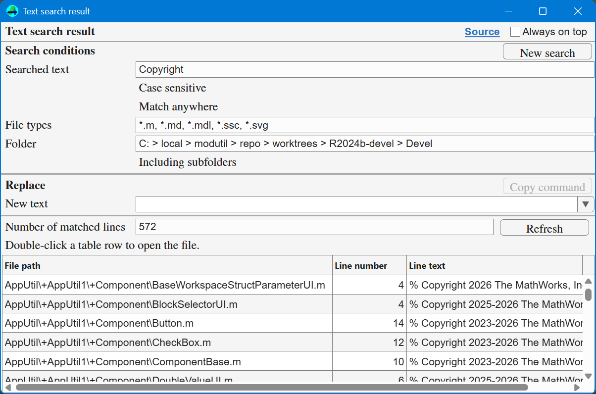<!-- w=800px -->

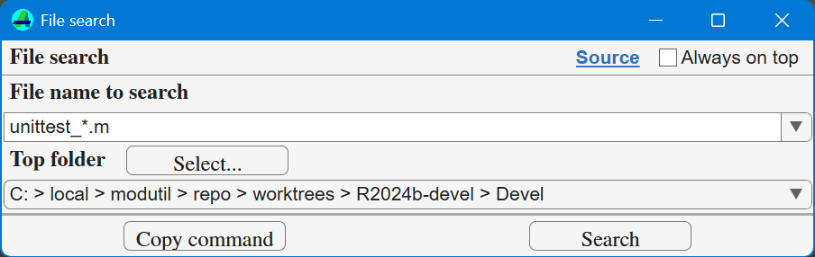<!-- w=600px -->

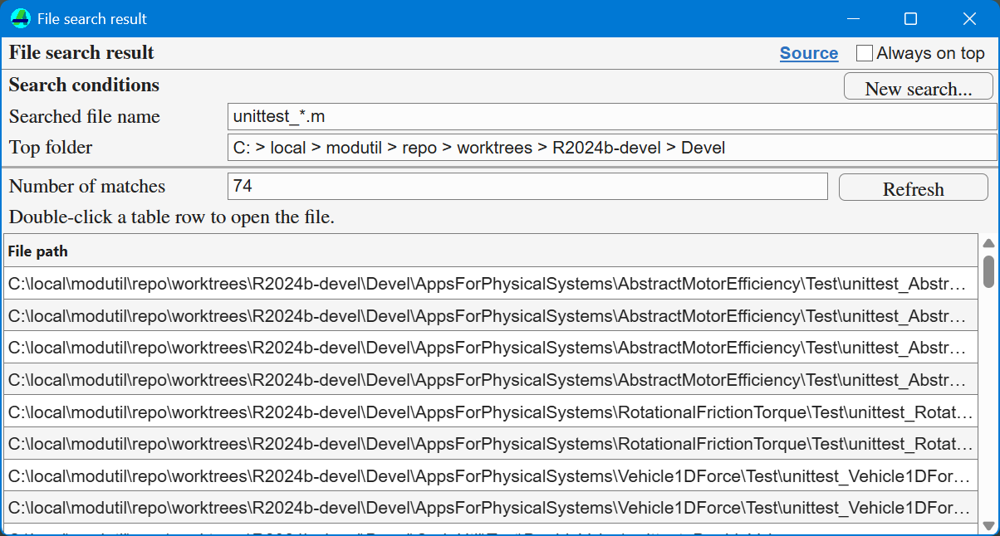<!-- w=800px -->

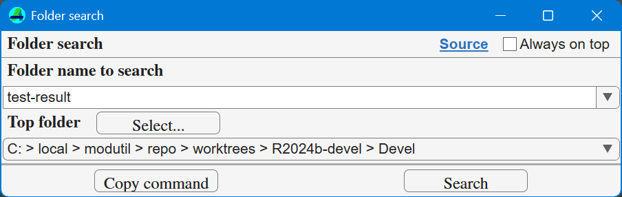<!-- w=600px -->

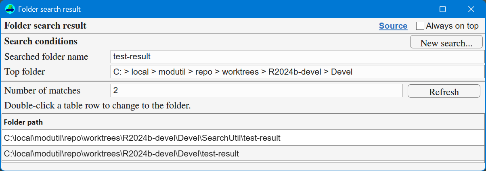<!-- w=800px -->

## **AppUtil** - Build apps for physical systems

Use the `AppUtil` API to build apps for physical systems.
The API supports using base workspace variables.

- Components such as `PhysicalValueWithUnitDropDown`
  can use variables in the base workspace.
- Variables in the base workspace can be numeric, struct, or `simscape.Value`.

The API uses the `uifigure` and `uigridlayout` functions
and is fully compatible with all UI components that work
with `uifigure` and `uigridlayout`.
The default settings of the API's components are configured
to nicely fit and align to each other.
The API makes it easy to align components vertically or horizontally.

All of the apps included in this utility are built with the API.

## **TestUtil** - Helper utility for testing

Use the `TestResultApp` to view test result generated by the Build Tool
and jump to a unit test code from the app.

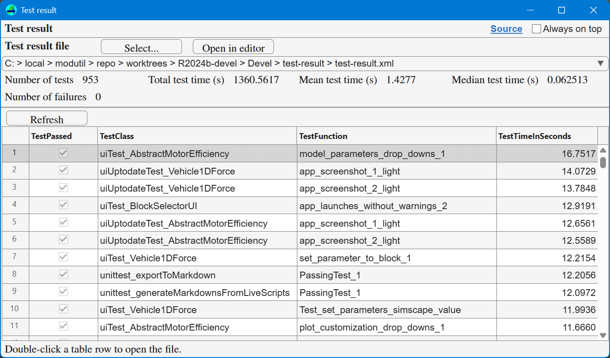<!-- w=900px -->

## Development of the utility

The development repository is hosted in GitHub:

https://github.com/isaacito12/modutil-simscape

## License

See `license.txt` for details.

_Copyright 2025-2026 The MathWorks, Inc._
